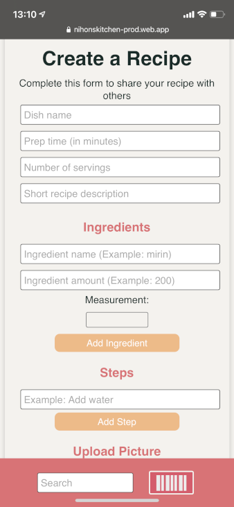
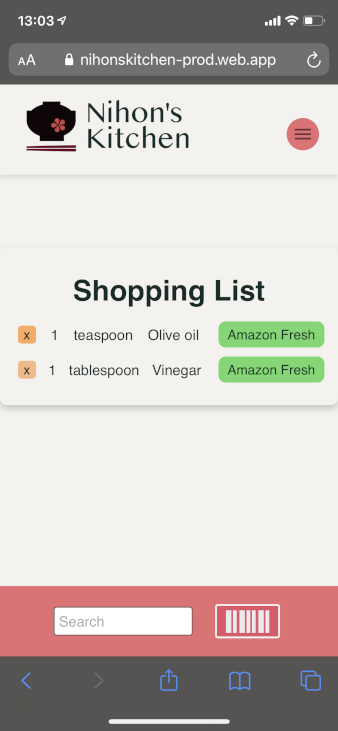

# Nihon's Kitchen

Welcome to Nihon's Kitchen! This project was created as a means to help English-speaking residents in Japan to share their awesome recipes that use Japanese ingredients. It can be difficult for newcomers to Japan to read and understand the packaging on Japanese food labels. So, we created a database where users can scan barcodes and enter English translations to help others.

[日本語の説明はこちらです。](./README.ja.md)

### Back End Repo

https://github.com/nihonskitchen/serverside

## Demo Link

You can try out Nihon's Kitchen here:

https://nihonskitchen-prod.web.app

## Live Presentation

Watch our team's live presentation of **Nihon's Kitchen** here: 

[](https://youtu.be/9_AITMa-fxw?t=1720)

## Usage   

### 1. Click on a recipe card to see a detailed list of ingredients and steps necessary to make the recipe.


### 2. To create a new recipe simply fill out the fields, upload a picture, and click submit.


  

### 3. Use the barcode scanner to get information about Japanese ingredients.  

 

### 4. Add ingredients from recipes to your shopping list and buy them easily online.   

 

## How to install the app

If you wish to install the app and checkout how the code works, please fork this repository and run the following:

```bash
# install dependencies
$ yarn install

# serve with hot reload at localhost:3000
$ yarn dev

# build for production and launch server
$ yarn build
$ yarn start

# generate static project
$ yarn generate
```

For detailed explanation on how things work, check out [Nuxt.js docs](https://nuxtjs.org).

## Current Features

1. Create and view recipes
2. Find and share product information via the barcode scanner
3. Add recipe ingredients to your shopping list and buy them online
4. Create and manage your user profile
5. Search to find specific recipes

## Future Features

1. Add recipes to your "Favorites" list
2. Comment on recipes
3. Give great recipes a thumbs up, or not-so-great ones a thumbs down
4. Show recipe prices
5. Edit and delete recipes
6. Recipe suggestions based on what you currently have in your refrigerator!

## Technologies Used

1. Vue.js: https://vuejs.org
2. NuxtJS: https://nuxtjs.org
3. QuaggaJS: https://serratus.github.io/quaggaJS
4. Firebase: https://firebase.google.com
   - Firebase Hosting
   - Firebase Authentication
   - Cloud Storage
   - Cloud Firestore
